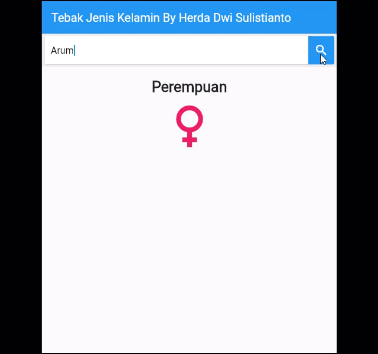

# Tebak jenis kelamin

## UAS Mobile Programming
Herda Dwi Sulistianto (12191695)

## Hasil :

saya membuat aplikasi sederhana tebak jenis kelamin dengan Flutter dengan memanfaatkan API dari website `genderize.io` .Jadi cara kerja aplikasi ini nantinya dengan hanya memasukkan nama,aplikasi akan menampilkan tebakan atau prediksi jenis kelamin dari nama tersebut.

## PENJELASAN :
1. fungsi build() membangun badan utama dari aplikasi
2. fungsi _search di dalam children build sebagai tampilan input pencarian jenis kelamin 
3. di dalam fungsi tersebut juga terdapat fungsi untuk melakukan tebak jenis kelamin berdasarkan inputan yang diisi user, dengen mencocokannya dengan API 'api.genderize.io'
4. fungsinya hanya menggunakan get data
5. Dengan melemparkan parameter name
6. Dia akan mengembalikan hasilnya dan menampilkannya di aplikasi
